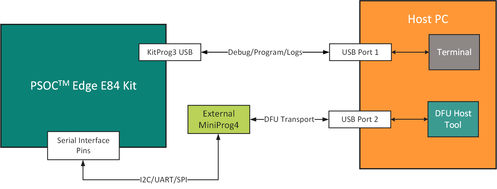
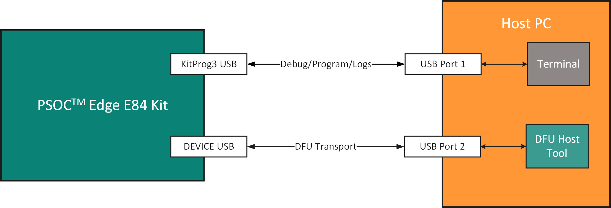
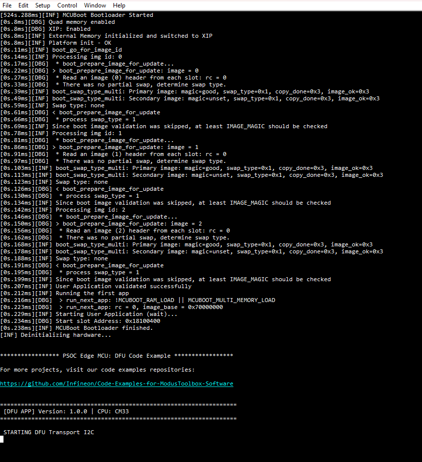
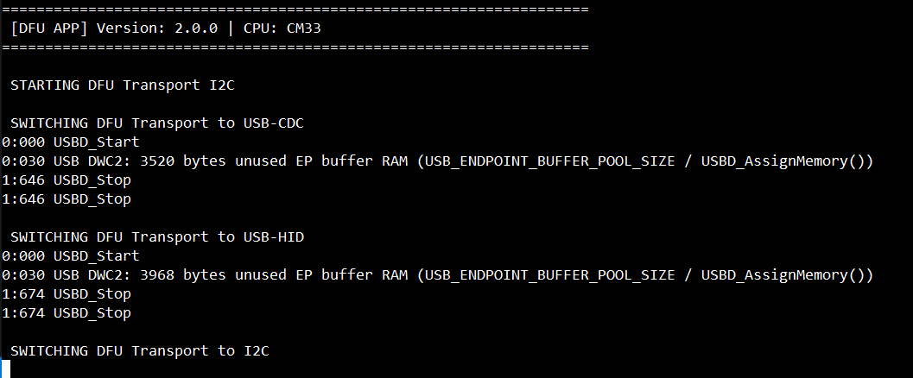
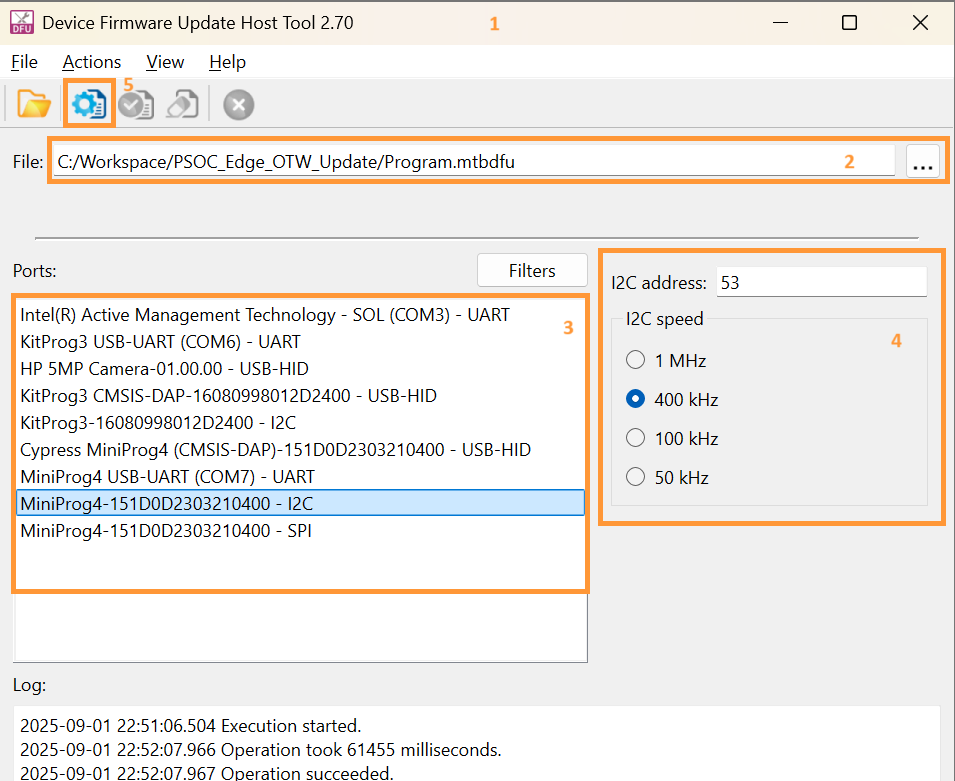
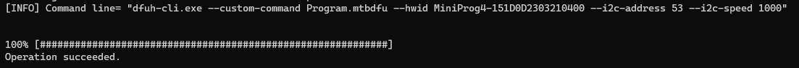
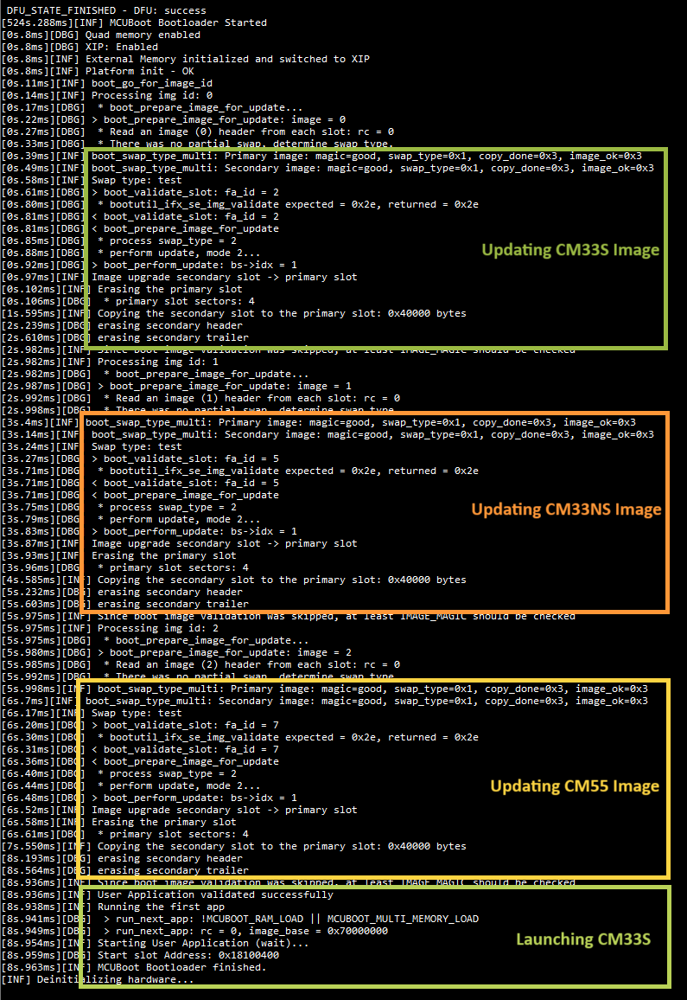

# PSOC&trade; Edge MCU: OTW(Over-the-Wire) Device Firmware Update

This code example demonstrates how to utilize Infineon's Device Firmware Update (DFU) middleware (MW) to update firmware over a serial interface (over-the-wire (OTW)), such as UART, SPI, I2C, or USB. 

The host (typically a PC) running the DFU Host Tool establishes a connection with the target device and downloads an application intended for the update. Images are downloaded to the staging region in non-volatile memory. Once downloaded successfully, the application resets the device to transfer the control to the bootloader. On reset, the bootloader validates the images in the staging region and installs it in the primary bootable region.

> **Note:** This CE only demonstrates I2C and USB interfaces for DFU. See other DFU code examples for SPI and UART interfaces.

This example also illustrates switching between I2C, USB-CDC, and USB-HID interfaces while the application is running without needing the device to be power cycled or programming recompiled binary. For example, on reset, this example selects I2C as the default interface for DFU. If you wish to change the interface to USB, simply press a user button (USER BTN1 - SW2) on PSOC™ Edge Evaluation kit and (USER BTN1 - SW1)  on PSOC™ Edge AI kit.

This code example has a three project structure: CM33 secure, CM33 non-secure, and CM55 projects. All three projects are programmed to the external QSPI flash and executed in Execute in Place (XIP) mode. It also requires you to add the EdgeProtect bootloader project (*proj_bootloader*). It needs to be programmed on the device RRAM and is executed in Execute in Place (XIP) mode. The EdgeProtect bootloader is responsible for validation and update of the images downloaded to the device.

Extended boot launches the Edge Protect bootloader present in RRAM from a fixed location. The bootloader then configures the external QSPI flash in XIP mode, validates all the three applications, and launches the cm33 secure application (*proj_cm33_s*). The cm33 secure application launches the cm33 non-secure application (*proj_cm33_ns*), which is responsible for DFU operations. Additionally, CM33 non-secure application enables the CM55 CPU and launches the CM55 application.

[View this README on GitHub.](https://github.com/Infineon/mtb-example-psoc-edge-otw-update)

[Provide feedback on this code example.](https://yourvoice.infineon.com/jfe/form/SV_1NTns53sK2yiljn?Q_EED=eyJVbmlxdWUgRG9jIElkIjoiQ0UyMzk0ODgiLCJTcGVjIE51bWJlciI6IjAwMi0zOTQ4OCIsIkRvYyBUaXRsZSI6IlBTT0MmdHJhZGU7IEVkZ2UgTUNVOiBPVFcoT3Zlci10aGUtV2lyZSkgRGV2aWNlIEZpcm13YXJlIFVwZGF0ZSIsInJpZCI6Im1hbmFuLmphaW5AaW5maW5lb24uY29tIiwiRG9jIHZlcnNpb24iOiIyLjIuMCIsIkRvYyBMYW5ndWFnZSI6IkVuZ2xpc2giLCJEb2MgRGl2aXNpb24iOiJNQ0QiLCJEb2MgQlUiOiJJQ1ciLCJEb2MgRmFtaWx5IjoiUFNPQyJ9)

See the [Design and implementation](docs/design_and_implementation.md) for the functional description of this example.


## Requirements

- [ModusToolbox&trade;](https://www.infineon.com/modustoolbox) v3.7 or later (tested with v3.7)
- Board support package (BSP) minimum required version: 1.0.0
- Programming language: C
- Associated parts: All [PSOC&trade; Edge MCU](https://www.infineon.com/products/microcontroller/32-bit-psoc-arm-cortex/32-bit-psoc-edge-arm) parts


## Supported toolchains (make variable 'TOOLCHAIN')

- GNU Arm&reg; Embedded Compiler v14.2.1 (`GCC_ARM`) – Default value of `TOOLCHAIN`
- Arm&reg; Compiler v6.22 (`ARM`)
- IAR C/C++ Compiler v9.50.2 (`IAR`)
- LLVM Embedded Toolchain for Arm&reg; v19.1.5 (`LLVM_ARM`)


## Supported kits (make variable 'TARGET')

- [PSOC&trade; Edge E84 Evaluation Kit](https://www.infineon.com/KIT_PSE84_EVAL) (`KIT_PSE84_EVAL_EPC2`) – Default value of `TARGET`
- [PSOC&trade; Edge E84 Evaluation Kit](https://www.infineon.com/KIT_PSE84_EVAL) (`KIT_PSE84_EVAL_EPC4`)
- [PSOC&trade; Edge E84 AI Kit](https://www.infineon.com/KIT_PSE84_AI) (`KIT_PSE84_AI`)

## Hardware setup

This example uses the board's default configuration. See the kit user guide to ensure that the board is configured correctly.

1. Ensure the following jumper and pin configuration on board
    - BOOT SW Pin (P17.6) should be in LOW/OFF position
    - J20 and J21 should be in tristate/not connected (NC) position

For the `KIT_PSE84_AI` kit, either remove the R188 resistor and populate the R187 resistor to pull the boot pin to LOW, or follow the provisioning method in the [Provisioning method](#provisioning-method) section to avoid hardware rework.

> **Note:** To evaluate the other supported code examples that boot from QSPI flash, the resistors should be reverted to default settings.

2. Make the following connections for the DFU Transport interface selected:
    > **Note:** This Code example uses I2C as the default DFU transport. Make sure you make connection accordingly, unless changed during build time or plan to change at runtime.

    Pin Function | Pin on PSOC&trade; Edge E84 Evaluation Kit | Pin on PSOC&trade; Edge E84 AI Kit
    ------------ | ----- | -----
    SERIAL_INT0  | J14.1 | J5.5
    SERIAL_INT1  | J14.2 | J5.4
    SERIAL_INT2  | J14.3 | J5.3
    SERIAL_INT3  | J14.4 | J5.2
    GND          | J14.5 | J5.6
    VDD (1.8 V)  | J23.1 | J5.1

    <details><summary><b> I2C Transport Setup </b></summary>

    1. To use I2C transport, make the following Pin connections
        - Connect the SERIAL_INT2 Pin on PSOC&trade; Edge E84 Evaluation Kit or PSOC&trade; Edge E84 AI Kit to SDA (Pin 2) of MiniProg4
        - Connect the SERIAL_INT3 Pin on PSOC&trade; Edge E84 Evaluation Kit or PSOC&trade; Edge E84 AI Kit to SCL (Pin 4) of MiniProg4
        - Make the required VDD (1.8 V) and GND connections

        **Figure 1. Sample I2C interface connection**

        

    2. Connect KitProg3 (on-board PSOC&trade; Edge E84 Evaluation Kit or PSOC&trade; Edge E84 AI Kit) to the PC

        While both KitProg3 and MiniProg4 (external) has to be connected to the PC, do not connect the MiniProg4 USB to the host PC just yet – until you are instructed to do so later in this README.

        The following figure shows the sample harware connection required for the example:

        **Figure 2. Sample hardware connection for I2C**

        

    </details>

    <details><summary><b> USB Transport Setup </b></summary>

    To use USB transport (USB-CDC/USB-HID), connect the **DEVICE-USB** port on the kit to the host PC

    **Figure 3. Sample Hardware connection for USB**

    

    </details>


## Software setup

See the [ModusToolbox&trade; tools package installation guide](https://www.infineon.com/ModusToolboxInstallguide) for information about installing and configuring the tools package.

Install a terminal emulator if you do not have one. Instructions in this document use [Tera Term](https://teratermproject.github.io/index-en.html).

This example requires no additional software or tools.

## Provisioning method

To avoid hardware rework on the `KIT_PSE84_AI` kit, customize the generated OEM policy JSON file to ignore the boot pin status while booting.

While following the provisioning steps, once the OEM key pair is generated, set the 'oem_alt_boot' to "false" in the *policy/policy_oem_provisioning.json* file in the project before provisioning the kit.

For detailed instructions to provision the kit, see the *Development flow* section in the [AN237849 – Getting started with PSOC&trade; Edge security](https://www.infineon.com/AN237849).

> **Note:** To evaluate other code examples that boot from QSPI flash, reprovision the kit with default settings by setting 'oem_alt_boot' to "true" in the *policy/policy_oem_provisioning.json* file in the project before reprovisioning the kit.

## Operation

### Add the Edge Protect Bootloader

1. Add **proj_bootloader** to this code example as a first step. Follow the steps #2 to #7 in the **Operation** section of the [Edge Protect Bootloader](https://github.com/Infineon/mtb-example-edge-protect-bootloader) code example's *README.md* file.

   > **Note:** [Edge Protect Bootloader](https://github.com/Infineon/mtb-example-edge-protect-bootloader) *README.md* describes how to add the bootloader to **Basic Secure App**. Add it to **this** code example instead.

   > **Note (For the `LLVM_ARM` toolchain):**  **Edge Protect Bootloader** does not support `LLVM_ARM`. In the **proj_bootloader** directory, edit the *Makefile* to force other supported toolchains for EPB (for example: `TOOLCHAIN=GCC_ARM`)

### Configure the Memory Map and Makefiles

2. Configure the memory map: this code example bundles a custom *design.modus* file compatible with EdgeProtect Bootloader. Hence, you need not make any further customozations here to use EPB and this project together

3. Configure the *Makefile* with appropriate post-build instructions. Open *common.mk* file in the root of the application and update the `COMBINE_SIGN_JSON` variables for each `IMG_TYPE` with the JSON files generated by the configurator as:

    - **For `BOOT_IMAGE`:** Combine application projects and EdgeProtect bootloder project for initial programming and booting.
        ```
        COMBINE_SIGN_JSON?=./bsps/TARGET_$(TARGET)/config/GeneratedSource/boot_with_bldr.json
        ```
    - **For `UPDATE_IMAGE`:** Combine only the application projects for update
        ```
        COMBINE_SIGN_JSON?=./bsps/TARGET_$(TARGET)/config/GeneratedSource/boot_with_bldr_upgr.json
        ```

### Program the application

See [Using the code example](docs/using_the_code_example.md) for instructions on creating a project, opening it in various supported IDEs, and performing tasks, such as building, programming, and debugging the application within the respective IDEs.

4. Connect the board to your PC using the provided USB cable through the KitProg3 USB connector

5. Open a terminal program and select the KitProg3 COM port. Set the serial port parameters to 8N1 and 115200 baud

6. After programming, the application starts automatically. Confirm that "PSOC Edge MCU: DFU Code Example" and "Version 1.0.0" is displayed on the UART terminal

    **Figure 4. Terminal output on program startup**

    

7. Confirm the kit LED1 blinks at approximately 1 Hz. This means that the application is booted successfully

### Prepare for firmware update

8. Build the firmware update image to be transfered to the device to perform the firmware update:
    
    1. Change the `IMG_TYPE?=BOOT` variable to `IMG_TYPE?=UPDATE` in the *common.mk* in the the application root folder 
    2. Rebuild the complete project
    
    > **Note:** Do not program this image using KitProg3

9. Select the DFU transport interface on the device by pressing **USER BTN1** until your desired DFU transport interface is selected. See **Figure 5** and check out [Switching DFU Transport Interface](docs/design_and_implementation.md#switching-the-dfu-transport-interface) to understand how this works

    > **Note:** Skip this step if you want to use the default (I2C) DFU transport interface

    **Figure 5. Terminal output on DFU transport switch**

    
    
### Perform firmware update

10. Download the update image to the device and launch the EdgeProtect bootloader to perform the firmware update.

    1. *mdbdfu* file having the right command sequence to transfer the update image is provided here - **`<Workspace>/<CodeExampleName>`/Program.mtbdfu**. Open the file and update the `dataFile` field in "commands" section with absolute path of the project hex file **`<Workspace>/<CodeExampleName>`/build/app_combined.hex**
    
    2. Ensure instructions in [**Hardware Setup**](#hardware-setup) section are followed and connect the MiniProg4 USB to the host PC (for I2C DFU transport)

    3. Download the firmware using either the DFU Host Tool GUI or CLI

        <details><summary><b>Using DFU Host Tool GUI</b></summary>

        1. Open *dfuh-tool.exe* located at *\<install-path>/ModusToolbox/tools_3.6/dfuh-tool*
        2. Select *`<Workspace>/<CodeExampleName>`/Program.mtbdfu* as the input file to DFU Host Tool
        3. Select the interface for which you have set up the hardware
        4. Configure the selected interface as per the [DFU Transport Interface Configuration](docs/design_and_implementation.md#dfu-transport-interface-configuration)
        5. Click on *Execute* button; see **Figure 6** for reference

            **Figure 6. DFU Host Tool GUI**

            

        </details>

        <details><summary><b>Using DFU Host Tool CLI</b></summary>

        1. Open the modus-shell terminal and move to DFU Host Tool directory (*[install-path]/ModusToolbox/tools_3.6/dfuh-tool*)
        2. Execute the following DFU CLI command from the Host Tool directory in the shell terminal:

            ```
            dfuh-cli.exe --custom-command path-to-mtbdfu-file --hwid Probe-id/COM Port  --interface-params 
            ```

            For example, to use I2C interface, use:

            ```
            dfuh-cli.exe --custom-command `<Workspace>/<CodeExampleName>`/Program.mtbdfu --hwid MiniProg4-151D0D2303210400 --i2c-speed 400 --i2c-address 53
            ```

            **Figure 7. Console output of DFU Host Tool CLI**

            

        </details>

        > **Note:** See [DFU Host Tool for ModusToolbox&trade; User Guide](https://www.infineon.com/ModusToolboxDFUHostTool) for more details on each of the interfaces
      
    4. After succesful download of the update image to the device, application triggers a system reset to launch the EdgeProtect bootloader for performing the update

        **Figure 8. Terminal output of image update**

        

11. After firmware update is complete, confirm "PSOC Edge MCU: DFU Code Example" and "Version 2.0.0" are displayed on the UART terminal. Confirm that the kit LED2 blinks at approximately 0.5 Hz

    **Figure 9. Terminal output of updated image**

    


## Related resources

Resources  | Links
-----------|----------------------------------
Application notes  | [AN235935](https://www.infineon.com/AN235935) – Getting started with PSOC&trade; Edge E8 MCU on ModusToolbox&trade; software
Code examples  | [Using ModusToolbox&trade;](https://github.com/Infineon/Code-Examples-for-ModusToolbox-Software) on GitHub
Device documentation | [PSOC&trade; Edge MCU datasheets](https://www.infineon.com/products/microcontroller/32-bit-psoc-arm-cortex/32-bit-psoc-edge-arm#documents) <br> [PSOC&trade; Edge MCU reference manuals](https://www.infineon.com/products/microcontroller/32-bit-psoc-arm-cortex/32-bit-psoc-edge-arm#documents)
Development kits | Select your kits from the [Evaluation board finder](https://www.infineon.com/cms/en/design-support/finder-selection-tools/product-finder/evaluation-board)
Libraries  | [mtb-dsl-pse8xxgp](https://github.com/Infineon/mtb-dsl-pse8xxgp) – Device support library for PSE8XXGP <br> [retarget-io](https://github.com/Infineon/retarget-io) – Utility library to retarget STDIO messages to a UART port <br> [serial-memory](https://github.com/Infineon/serial-memory) - Serial Flash Middleware for External memory interface <br> [DFU](https://github.com/Infineon/dfu) – Device Firmware Update Middleware (DFU MW) <br> [emusb-device](https://github.com/Infineon/emusb-device) – USB Device stack for embedded applications
Tools  | [ModusToolbox&trade;](https://www.infineon.com/modustoolbox) – ModusToolbox&trade; software is a collection of easy-to-use libraries and tools enabling rapid development with Infineon MCUs for applications ranging from wireless and cloud-connected systems, edge AI/ML, embedded sense and control, to wired USB connectivity using PSOC&trade; Industrial/IoT MCUs, AIROC&trade; Wi-Fi and Bluetooth&reg; connectivity devices, XMC&trade; Industrial MCUs, and EZ-USB&trade;/EZ-PD&trade; wired connectivity controllers. ModusToolbox&trade; incorporates a comprehensive set of BSPs, HAL, libraries, configuration tools, and provides support for industry-standard IDEs to fast-track your embedded application development

<br>


## Other resources

Infineon provides a wealth of data at [www.infineon.com](https://www.infineon.com) to help you select the right device, and quickly and effectively integrate it into your design.


## Document history

Document title: *CE239488* – *PSOC&trade; Edge MCU: OTW Device Firmware Update*

 Version | Description of change
 ------- | ---------------------
 1.x.0   | New code example <br> Early access release
 2.0.0   | GitHub release
 2.0.1   | Updated .gitignore file
 2.1.0   | Added support for KIT_PSE84_AI
 2.2.0   | Updated design files to fix ModusToolbox&trade; v3.7 build warnings
<br>


All referenced product or service names and trademarks are the property of their respective owners.

The Bluetooth&reg; word mark and logos are registered trademarks owned by Bluetooth SIG, Inc., and any use of such marks by Infineon is under license.

PSOC&trade;, formerly known as PSoC&trade;, is a trademark of Infineon Technologies. Any references to PSoC&trade; in this document or others shall be deemed to refer to PSOC&trade;.

---------------------------------------------------------

© Cypress Semiconductor Corporation, 2023-2025. This document is the property of Cypress Semiconductor Corporation, an Infineon Technologies company, and its affiliates ("Cypress").  This document, including any software or firmware included or referenced in this document ("Software"), is owned by Cypress under the intellectual property laws and treaties of the United States and other countries worldwide.  Cypress reserves all rights under such laws and treaties and does not, except as specifically stated in this paragraph, grant any license under its patents, copyrights, trademarks, or other intellectual property rights.  If the Software is not accompanied by a license agreement and you do not otherwise have a written agreement with Cypress governing the use of the Software, then Cypress hereby grants you a personal, non-exclusive, nontransferable license (without the right to sublicense) (1) under its copyright rights in the Software (a) for Software provided in source code form, to modify and reproduce the Software solely for use with Cypress hardware products, only internally within your organization, and (b) to distribute the Software in binary code form externally to end users (either directly or indirectly through resellers and distributors), solely for use on Cypress hardware product units, and (2) under those claims of Cypress's patents that are infringed by the Software (as provided by Cypress, unmodified) to make, use, distribute, and import the Software solely for use with Cypress hardware products.  Any other use, reproduction, modification, translation, or compilation of the Software is prohibited.
<br>
TO THE EXTENT PERMITTED BY APPLICABLE LAW, CYPRESS MAKES NO WARRANTY OF ANY KIND, EXPRESS OR IMPLIED, WITH REGARD TO THIS DOCUMENT OR ANY SOFTWARE OR ACCOMPANYING HARDWARE, INCLUDING, BUT NOT LIMITED TO, THE IMPLIED WARRANTIES OF MERCHANTABILITY AND FITNESS FOR A PARTICULAR PURPOSE.  No computing device can be absolutely secure.  Therefore, despite security measures implemented in Cypress hardware or software products, Cypress shall have no liability arising out of any security breach, such as unauthorized access to or use of a Cypress product. CYPRESS DOES NOT REPRESENT, WARRANT, OR GUARANTEE THAT CYPRESS PRODUCTS, OR SYSTEMS CREATED USING CYPRESS PRODUCTS, WILL BE FREE FROM CORRUPTION, ATTACK, VIRUSES, INTERFERENCE, HACKING, DATA LOSS OR THEFT, OR OTHER SECURITY INTRUSION (collectively, "Security Breach").  Cypress disclaims any liability relating to any Security Breach, and you shall and hereby do release Cypress from any claim, damage, or other liability arising from any Security Breach.  In addition, the products described in these materials may contain design defects or errors known as errata which may cause the product to deviate from published specifications. To the extent permitted by applicable law, Cypress reserves the right to make changes to this document without further notice. Cypress does not assume any liability arising out of the application or use of any product or circuit described in this document. Any information provided in this document, including any sample design information or programming code, is provided only for reference purposes.  It is the responsibility of the user of this document to properly design, program, and test the functionality and safety of any application made of this information and any resulting product.  "High-Risk Device" means any device or system whose failure could cause personal injury, death, or property damage.  Examples of High-Risk Devices are weapons, nuclear installations, surgical implants, and other medical devices.  "Critical Component" means any component of a High-Risk Device whose failure to perform can be reasonably expected to cause, directly or indirectly, the failure of the High-Risk Device, or to affect its safety or effectiveness.  Cypress is not liable, in whole or in part, and you shall and hereby do release Cypress from any claim, damage, or other liability arising from any use of a Cypress product as a Critical Component in a High-Risk Device. You shall indemnify and hold Cypress, including its affiliates, and its directors, officers, employees, agents, distributors, and assigns harmless from and against all claims, costs, damages, and expenses, arising out of any claim, including claims for product liability, personal injury or death, or property damage arising from any use of a Cypress product as a Critical Component in a High-Risk Device. Cypress products are not intended or authorized for use as a Critical Component in any High-Risk Device except to the limited extent that (i) Cypress's published data sheet for the product explicitly states Cypress has qualified the product for use in a specific High-Risk Device, or (ii) Cypress has given you advance written authorization to use the product as a Critical Component in the specific High-Risk Device and you have signed a separate indemnification agreement.
<br>
Cypress, the Cypress logo, and combinations thereof, ModusToolbox, PSoC, CAPSENSE, EZ-USB, F-RAM, and TRAVEO are trademarks or registered trademarks of Cypress or a subsidiary of Cypress in the United States or in other countries. For a more complete list of Cypress trademarks, visit www.infineon.com. Other names and brands may be claimed as property of their respective owners.
